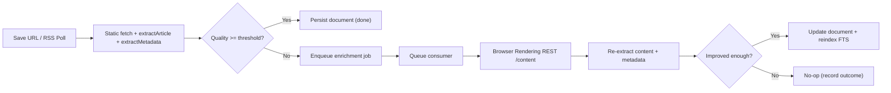

# Browser Rendering + Robust Metadata Extraction Plan

**Version:** 1.0  
**Date:** February 20, 2026  
**Status:** Proposed  
**Audience:** Implementation handoff to a new engineering agent

---

## 1. Executive Summary

Focus Reader should keep fast ingestion while improving extraction quality on JavaScript-heavy pages.  
The strategy is:

1. Strengthen static metadata extraction first (JSONY-LD, Twitter, Microdata, `<time>`, better URL resolution).
2. Score extraction quality after static extraction.
3. If quality is low, enqueue async enrichment.
4. Enrichment worker uses Cloudflare Browser Rendering REST `/content` to fetch rendered HTML.
5. Re-run article + metadata extraction on rendered HTML and update the document only when quality improves.

This gives fast saves, better final quality, and controlled Browser Rendering cost.

---

## 2. Why This Strategy Is Useful

### Benefits

- **Higher extraction success on modern sites:** post-hydration HTML captures content and metadata unavailable in raw source HTML.
- **Better metadata completeness:** JSON-LD/Twitter/Microdata support improves author/date/image/site extraction without rendering.
- **Good UX latency:** users get immediate saves; expensive rendering runs only when needed.
- **Cost control:** Browser Rendering is fallback-only behind quality gates.
- **Operational safety:** async retries and dead-letter handling isolate transient render failures from user-facing ingestion.

### Tradeoffs

- More moving parts (queue, worker consumer, config, retry handling).
- Eventual consistency (document may be upgraded a few seconds later).
- Need clear idempotency and stale-job protection.

---

## 3. Current State (Ground Truth)

### Existing implementation

- `/Users/george/work/keepread/app/packages/parser/src/metadata.ts` currently extracts mostly OG/basic meta fields.
- `/Users/george/work/keepread/app/packages/parser/src/article.ts` uses Readability on available HTML.
- `/Users/george/work/keepread/app/packages/api/src/documents.ts`:
  - `createBookmark()` fetches raw HTML when not supplied by caller.
  - Runs `extractArticle()` and `extractMetadata()` synchronously.
- `/Users/george/work/keepread/app/packages/api/src/feed-polling.ts`:
  - For `fetch_full_content = 1`, fetches item URL and runs `extractArticle()`.
  - Does **not** currently run `extractMetadata()` in this file.
- No queue-based enrichment pipeline exists.
- No Cloudflare Browser Rendering integration exists.

### Important constraints

- Worker-compatible runtime only.
- Multi-tenant DB access must use `UserScopedDb`.
- `pnpm build && pnpm typecheck && pnpm test` must pass before handoff complete.

---

## 4. Product and Technical Decisions (Locked)

1. **Latency mode:** fast save first, then async upgrade.
2. **Scope (v1):** manual URL saves and RSS items with `fetch_full_content = 1`.
3. **Cost guardrail:** Browser Rendering runs only when static quality is below threshold (heuristic fallback).
4. **Async mechanism:** Cloudflare Queue-based enrichment worker.
5. **Rendering integration mode:** Cloudflare Browser Rendering REST `/content` endpoint (not Puppeteer binding for v1).

---

## 5. Goals and Non-Goals

### Goals

- Improve extraction robustness for article body and metadata.
- Avoid slowing down primary ingestion request latency.
- Keep implementation decision-complete and testable.
- Preserve tenant isolation and idempotent updates.

### Non-Goals (v1)

- No new UI surface for enrichment controls.
- No document schema migration required for core rollout.
- No domain-specific extractor plugins (YouTube/X/GitHub) yet.
- No Browser Rendering usage for email ingestion.

---

## 6. Target Architecture



---

## 7. Data Contracts and Interfaces

## 7.1 Shared job payload (new)

**File:** `/Users/george/work/keepread/app/packages/shared/src/types.ts`

Add:

```ts
export type EnrichmentSource = "manual_url" | "rss_full_content";

export interface ExtractionEnrichmentJob {
  job_id: string;
  user_id: string;
  document_id: string;
  url: string;
  source: EnrichmentSource;
  attempt: number;
  enqueued_at: string;
}
```

Export via `/Users/george/work/keepread/app/packages/shared/src/index.ts` if needed.

## 7.2 Quality score helper (new)

**File:** `/Users/george/work/keepread/app/packages/api/src/extraction-quality.ts`

Add deterministic scorer:

- `scoreExtraction(input): number` (0-100)
- `shouldEnrich(score, hints): boolean`
- `isImprovement(oldScore, newScore, oldDoc, newExtract): boolean`

Scoring factors (default v1):

- title quality: 0-15
- content availability and size: 0-35
- metadata completeness (author/site/date/image/excerpt): 0-30
- readability signal (word count, excerpt plausibility): 0-20

Default threshold: `55`.
Improvement gate: `newScore >= oldScore + 10` OR old content missing and new content present.

## 7.3 Browser Rendering client (new)

**File:** `/Users/george/work/keepread/app/packages/api/src/browser-rendering-client.ts`

API:

```ts
export interface BrowserRenderingConfig {
  enabled: boolean;
  accountId: string;
  apiToken: string;
  timeoutMs: number;
}

export async function fetchRenderedHtml(
  url: string,
  config: BrowserRenderingConfig
): Promise<string>;
```

Behavior:

- Uses REST `/content`.
- Timeout via `AbortController`.
- Maps retryable errors (429, 5xx, timeout) vs terminal errors (4xx invalid URL/auth).

---

## 8. Environment and Infra Changes

## 8.1 Queue binding

Add `EXTRACTION_QUEUE` producer/consumer wiring in Wrangler files:

- `/Users/george/work/keepread/app/apps/web/wrangler.toml` (producer)
- `/Users/george/work/keepread/app/apps/rss-worker/wrangler.toml` (producer and consumer)

Use Cloudflare queue config blocks:

- producer binding in web and rss-worker
- consumer queue in rss-worker
- optional dead letter queue (`EXTRACTION_QUEUE_DLQ`)

## 8.2 Browser Rendering credentials

Add environment variables for consumer runtime:

- `BROWSER_RENDERING_ENABLED` (`"true"`/`"false"`)
- `BROWSER_RENDERING_ACCOUNT_ID`
- `BROWSER_RENDERING_API_TOKEN`
- `BROWSER_RENDERING_TIMEOUT_MS` (default `12000`)

Update env typings:

- `/Users/george/work/keepread/app/apps/web/src/lib/bindings.ts`
- `/Users/george/work/keepread/app/apps/rss-worker/src/index.ts` `Env` interface

---

## 9. Implementation Plan (Phased)

## Phase 1: Strengthen static metadata extraction

### Files

- `/Users/george/work/keepread/app/packages/parser/src/metadata.ts`
- `/Users/george/work/keepread/app/packages/parser/src/__tests__/metadata.test.ts` (new)

### Work

1. Add JSON-LD parsing with:
   - multiple script blocks
   - `@graph` support
   - tolerant parse failures
2. Add helper accessors for:
   - string path reads
   - author variants (string/object/array)
   - image variants (string/object/array)
3. Extend extraction chains:
   - `twitter:title`, `twitter:description`, `twitter:image`, `twitter:image:src`
   - itemprop fallbacks (`headline`, `author`, `datePublished`, `image`, publisher name)
   - `<time datetime>` fallback
4. Add `lang` and `feedUrl` to `PageMetadata`.
5. Normalize relative URLs for canonical/image/favicon/feed links.

### Acceptance for Phase 1

- Parser tests cover priority order and malformed JSON-LD.
- Existing parser tests remain green.

---

## Phase 2: Add quality scoring and enrichment decision hooks

### Files

- `/Users/george/work/keepread/app/packages/api/src/extraction-quality.ts` (new)
- `/Users/george/work/keepread/app/packages/api/src/documents.ts`
- `/Users/george/work/keepread/app/packages/api/src/feed-polling.ts`
- `/Users/george/work/keepread/app/packages/api/src/index.ts`

### Work

1. Compute extraction quality after static extraction in both manual and RSS flows.
2. Return/emit enrichment intent when low quality:
   - manual flow: after `createDocument`
   - RSS flow: after `createDocument` for `fetch_full_content = 1`
3. Keep API-level code pure from queue implementation by using callback or optional enqueue function parameter.
4. Preserve existing return signatures where possible; if changed, update all callsites and tests.

### Acceptance for Phase 2

- Deterministic scorer unit tests added.
- No change to normal successful ingestion behavior except low-quality flagging.

---

## Phase 3: Queue producer integration

### Files

- `/Users/george/work/keepread/app/apps/web/src/app/api/documents/route.ts`
- `/Users/george/work/keepread/app/apps/web/src/lib/bindings.ts`
- `/Users/george/work/keepread/app/apps/rss-worker/src/index.ts`
- `/Users/george/work/keepread/app/packages/shared/src/types.ts`

### Work

1. Add queue binding access in web route.
2. After manual save completes and quality is low, enqueue `ExtractionEnrichmentJob`.
3. In RSS scheduled path, enqueue when low quality for eligible items.
4. Ensure enqueue failures are non-fatal to document creation (log warning only).
5. Ensure duplicate enqueue protection at source:
   - include `document_id` and `attempt`.
   - avoid enqueue when URL missing or non-http(s).

### Acceptance for Phase 3

- Manual URL and RSS flows still succeed if queue unavailable.
- Queue payload schema validated by TypeScript.

---

## Phase 4: Queue consumer + Browser Rendering client

### Files

- `/Users/george/work/keepread/app/packages/api/src/browser-rendering-client.ts` (new)
- `/Users/george/work/keepread/app/apps/rss-worker/src/index.ts`
- `/Users/george/work/keepread/app/packages/api/src/documents.ts` (or new enrichment module)
- `/Users/george/work/keepread/app/packages/db/src/queries/documents.ts`
- `/Users/george/work/keepread/app/packages/db/src/queries/search.ts`

### Work

1. Add `queue(batch, env, ctx)` handler to rss-worker.
2. For each message:
   - validate payload
   - load current document (scoped by `user_id`)
   - fetch rendered HTML via `/content`
   - run `extractArticle()` and `extractMetadata()`
   - score new result
3. Update document only on improvement gate.
4. Add DB query helper for enrichment update (single focused update statement).
5. Reindex FTS when text-bearing fields change:
   - deindex + index using existing helpers.
6. Ack/retry strategy:
   - retry on transient rendering failures
   - ack terminal failures
   - route repeated failures to DLQ.

### Acceptance for Phase 4

- Consumer is idempotent for repeated job delivery.
- Stale/duplicate jobs do not degrade document quality.

---

## Phase 5: Observability and feature flag rollout safety

### Files

- `/Users/george/work/keepread/app/packages/db/src/queries/ingestion-log.ts` (reuse existing)
- `/Users/george/work/keepread/app/packages/api/src/feed-polling.ts`
- `/Users/george/work/keepread/app/apps/rss-worker/src/index.ts`

### Work

1. Log enrichment outcomes with explicit codes:
   - `ENRICHMENT_QUEUED`
   - `ENRICHMENT_RENDER_FAILED`
   - `ENRICHMENT_NO_IMPROVEMENT`
   - `ENRICHMENT_APPLIED`
2. Guard all rendering logic behind `BROWSER_RENDERING_ENABLED`.
3. Add metrics-friendly structured logs with:
   - source
   - score_before/after
   - retry count
   - render latency ms

### Acceptance for Phase 5

- Feature can be disabled without code changes.
- Logs support production tuning of threshold and retry policy.

---

## 10. Detailed Test Plan

## 10.1 Parser unit tests

**File:** `/Users/george/work/keepread/app/packages/parser/src/__tests__/metadata.test.ts` (new)

Required cases:

1. JSON-LD article extraction.
2. JSON-LD `@graph` selection.
3. Author variants: string/object/array.
4. Image variants: string/object/array.
5. Twitter-only fallback.
6. Microdata-only fallback.
7. `<time datetime>` date fallback.
8. Feed autodiscovery URL resolution.
9. Malformed JSON-LD graceful fallback.
10. Rule priority when OG + Twitter + JSON-LD all present.
11. Relative canonical/favicon/image URL resolution.

## 10.2 API unit tests

Add or extend tests in:

- `/Users/george/work/keepread/app/packages/api/src/__tests__/...`

Cases:

1. low quality triggers enqueue intent.
2. high quality does not trigger enqueue.
3. extension-supplied HTML path skips enrichment enqueue.
4. score improvement gate correctness.

## 10.3 Web route tests

**File:** `/Users/george/work/keepread/app/apps/web/src/__tests__/api/documents.test.ts`

Cases:

1. successful save still returns `201` when queue enqueue fails.
2. low-quality save attempts queue send.
3. high-quality save does not queue.

## 10.4 RSS worker tests

**File:** `/Users/george/work/keepread/app/apps/rss-worker/src/__tests__/rss-worker.test.ts`

Cases:

1. queue consumer applies improved extraction.
2. consumer no-op when no improvement.
3. transient Browser Rendering failure retries.
4. missing/deleted document ack no-op.
5. tenant mismatch never updates foreign user rows.

---

## 11. Rollout Plan

1. **Deploy Phase 1 only** (metadata extraction hardening, no queue/rendering).
2. **Deploy queue plumbing disabled** (`BROWSER_RENDERING_ENABLED=false`).
3. **Enable in staging** with threshold `55`, verify:
   - queue volume
   - success rate
   - average render latency
   - final score uplift
4. **Enable in production** for fallback-only mode.
5. Tune:
   - threshold (`50-65` expected useful range)
   - timeout (`8-15s`)
   - max retries (`3`)

Rollback: disable feature flag; ingestion reverts to static extraction path.

---

## 12. Risks and Mitigations

1. **Cost spikes from over-triggering**
   - Mitigation: strict threshold + source gating + telemetry.
2. **Queue backlogs**
   - Mitigation: consumer concurrency tuning + DLQ.
3. **Rendered output not better than static**
   - Mitigation: improvement gate and no-op updates.
4. **Search index drift after updates**
   - Mitigation: mandatory reindex on enrichment update path.
5. **Credential/config errors**
   - Mitigation: startup validation logs and clear error codes.

---

## 13. Handoff Checklist (for next agent)

1. Read this plan fully and confirm all locked decisions.
2. Implement in phase order; do not start queue consumer before scorer and payload types exist.
3. Keep changes incremental with passing tests after each phase.
4. Validate wrangler queue config in both web and rss-worker apps.
5. Run final verification:

```bash
pnpm build && pnpm typecheck && pnpm test
```

6. Document any deviations from this plan in PR notes under "Decision Changes".

---

## 14. Final Acceptance Criteria

1. Manual URL saves return quickly and create documents even when rendering is unavailable.
2. Low-quality extractions are asynchronously enriched through queue + Browser Rendering.
3. Improved extraction updates persisted document fields and search index.
4. High-quality static extractions do not invoke Browser Rendering.
5. Multi-tenant boundaries are preserved for all enrichment updates.
6. Full monorepo build, typecheck, and tests pass.

